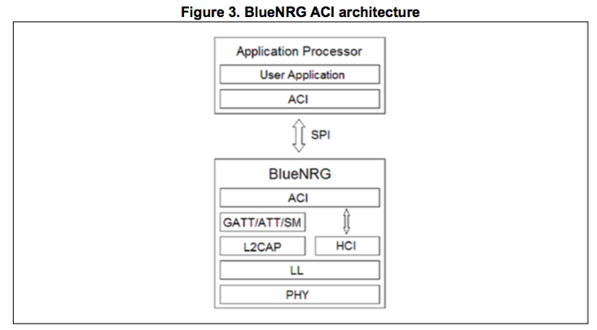
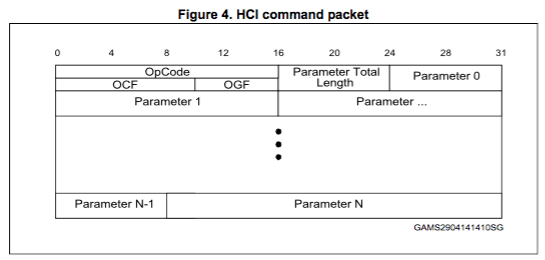
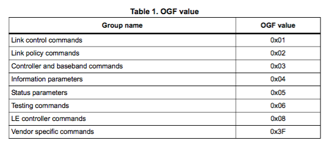
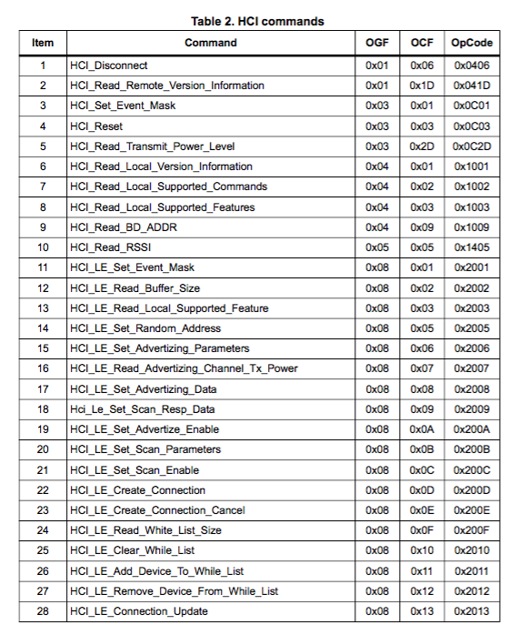
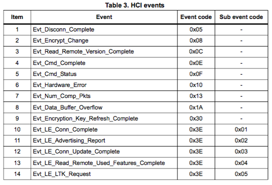
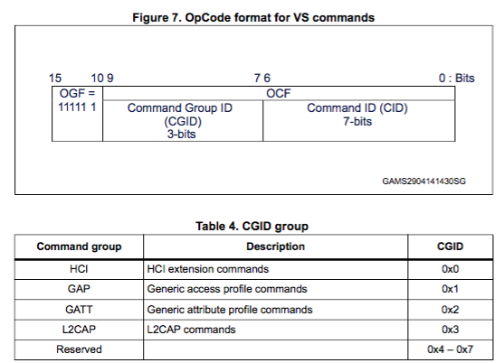
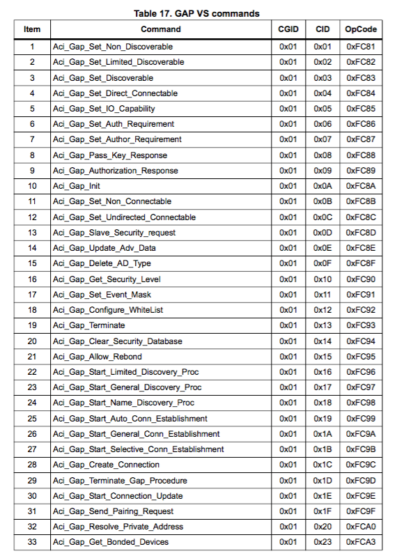
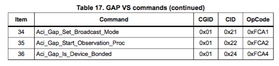
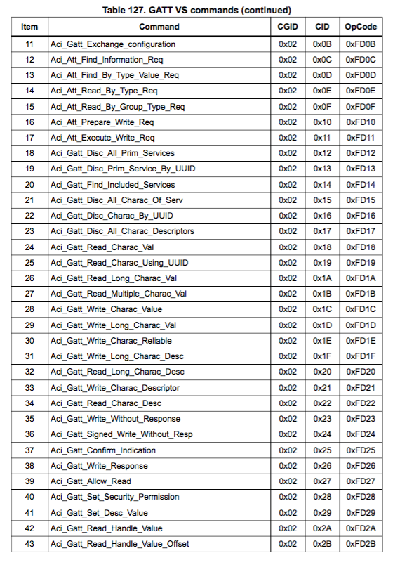
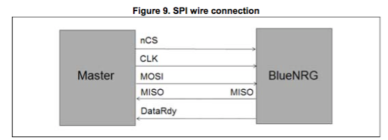

本文翻译BlueNRG-MS的ACI命令手册的核心内容。

> 源文档是[ACI命令手册](http://www2.st.com/content/ccc/resource/technical/document/user_manual/6d/a1/5b/6c/dc/ab/48/76/DM00162667.pdf/files/DM00162667.pdf/jcr:content/translations/en.DM00162667.pdf)。

> 关于BlueNRG-MS的所有官方资料，请点击[这里](http://www2.st.com/content/st_com/en/products/wireless-connectivity/bluetooth-bluetooth-low-energy/bluenrg-ms.html)。

***
## BlueNRG-MS的ACI

之前说到BlueNRG的方案框图如下：

MCU和BlueNRG-MS之间通过一种ACI规范进行通信，即Application Controller Interface，它基于SPI总线，扩展了标准的HCI规范(Host-Controller Interface)。

***
## ACI数据格式
从标准的HCI说起，标准的HCI有一下几种数据类型：
1. HCI command packet - HCI命令包
2. HCI ACL data packet - HCI ACL数据包
3. HCI synchronous data packet - HCI同步数据包
4. HCI event packet - HCI事件包

这些都可以在[蓝牙4.0规范手册](https://www.bluetooth.com/specifications/bluetooth-core-specification)上查到，这里不再详述，BlueNRG-MS支持除了第3种以外的HCI标准数据类型，下面分别阐述。

###1. HCI command packet

OpCode分为OpCode Group Field(OGF)和OpCode Command Field(OCF).
关于OGF，HCI有如下定义：

说明：

- 标准HCI是都*非*`0x3f`的报文，详情参见上述蓝牙4.0规范手册；
- `0x3f`的报文就是Vendor Specific(VS) HCI命令，即厂商自定义的HCI报文，我们所说的ACI规范就属于这个部分；

总的来讲，从数据格式来说，ACI是HCI的衍生，符合格式符合HCI里面VS报文。从应用上来说，HCI是偏向控制Controller的，而ACI更侧重于蓝牙系统整体，不光是Controller，也包括了对Host的操作定义。

###2. HCI event packet
这部分数据格式参见蓝牙4.0规范手册；

###3. HCI ACL data packet
这部分数据格式参见蓝牙4.0规范手册；

***
## 标准HCI命令和事件
我们摘取部分标准HCI命令和事件，这些都是BlueNRG-MS所支持的，让大家对标准的HCI命令和事件有个感性认识，从名称上就可以看出是什么意思的：

***
## ACI命令和事件(Vendor Specific HCI)

之前说到，OpCode分为中的OGF，我们来看一下OCF的格式：

说明：

- L2CAP 是偏向于链路层的操作；
- GAP 是高一层的access profile，如可发现、可连接、主设备、从设备等概念；
- GATT 是更高一层的attribute profile，如添加服务、读写特征值等概念；

重点是ACI里面的GAP和GATT，我们分别来看。

###1. ACI的GAP

GAP规定了四种蓝牙角色：

- 广播者：设备发送广播数据，该设备至少有个发送器，可以没有接收器；
- 观察者：设备监听广播数据，该设备至少有个接收器，可以没有发送器；
- 外围设备：设备可以被连接，连接后成为Slave状态；
- 中心设备：设备可以连接外围设备，连接后成为Master状态；

BlueNRG-MS是支持主从一体的设备，所以可以担任上述4种角色，在GAP层面定义了相关操作。

摘取部分如下：

###2. ACI的GATT

摘取部分如下：

相信大家有了一定的蓝牙概念后，看名称就明白是做什么样操作。

***
## SPI
ACI基于SPI总线

BlueNRG-MS会进入Sleep模式以降低功耗，当nCS被拉低时，BlueNRG-MS会被唤醒，但是唤醒有一个过程，在nCS拉低后，Host应给BlueNRG-MS至少0.5ms的时间，再开始SPI的通信。

