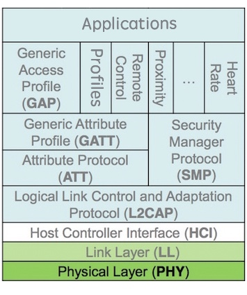
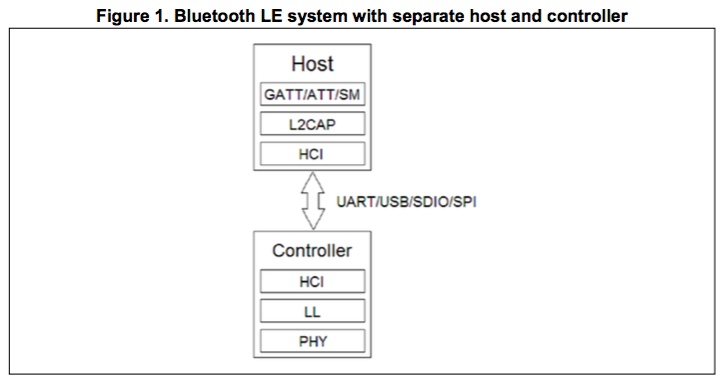
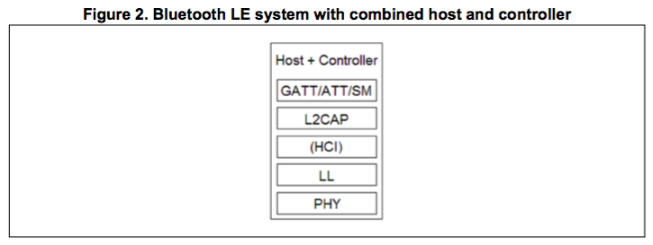
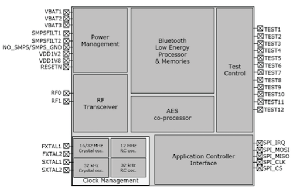

本文翻译BlueNRG-MS的芯片手册的核心内容。

> 源文档是[BlueNRG-MS芯片手册](http://www2.st.com/resource/en/datasheet/bluenrg-ms.pdf)和[ACI命令手册](http://www2.st.com/content/ccc/resource/technical/document/user_manual/6d/a1/5b/6c/dc/ab/48/76/DM00162667.pdf/files/DM00162667.pdf/jcr:content/translations/en.DM00162667.pdf)。

> 关于BlueNRG-MS的所有官方资料，请点击[这里](http://www2.st.com/content/st_com/en/products/wireless-connectivity/bluetooth-bluetooth-low-energy/bluenrg-ms.html)。

***
## 低功耗蓝牙方案

###1. 分层结构
低功耗蓝牙的方案分层结构如下所示：

低功耗蓝牙协议栈包含了以下几个部分：

- PHY：物理层，包含信道、频段、调制方式等概念；
- LL：链路层，包含比特率、时序、纠错、加解密等概念；
- L2CAP：逻辑链路控制适配层，包含如建立链连接、断开连接等概念；
- ATT/GATT：通用属性层，类似Socket里的Client/Server，包含UUID、特征值、描述符等概念；
- GAP：各种Profile的基础；
- Profile：针对某些特定应用商定的协议，如心率、近距离感应、遥控等，用户也可以自定义Profile；
- Application：应用层，各自发挥创新的地方，比如心率Profile中检测到心率过高报警等；

其中，HCI是Host和Controller之间的接口规范，一般为SPI、Uart、USB等总线，定义了一些列和LL层有关的命令和事件，如建立连接、断开连接、开始广播、停止广播等；

###2. 典型方案

SoC方案：将以上全部内容都运行在单个芯片上，常见的实现方案有：Nordic nRF51822、TI CC254x系列等。不过SoC的资源有限，常常满足不了需求，如处理能力不够、实时性不强等。

“MCU+蓝牙透传模块”方案：该方案使用SoC作为蓝牙透传模块负责蓝牙通信，通常将蓝牙数据转换为串口数据。好处是MCU不需要涉足蓝牙协议栈，不过各个厂家实现起来有所差异，蓝牙转串口也没有统一标准。

“Host+Controller”方案：Host运行高层BLE协议，Controller运行底层BLE协议，之间用HCI规范通信。由于HOST需要涉足BLE协议栈，嵌入式MCU上采用这种方案的比较少，手机或者PC端采用这种方案的比较多。

***
## BlueNRG-MS方案框图

我们来看一下“Host+Controller”方案框图：

在嵌入式系统上Host就是MCU，在MCU上运行BLE协议栈协议(GATT/ATT/SM/L2CAP)必然会消耗宝贵的MCU资源，如运算、内存、中断等资源，为此，对“Host+Controller”方案进行改进：

最终，BlueNRG的方案框图如下：

###1. BlueNRG-MS
BlueNRG-MS负责完成蓝牙协议栈和蓝牙数据收发。

低功耗蓝牙基于2.4GHz频段，图中“2.4GHz Radio”规定了基带层的协议，它其实是一个2.4GHz信号收发器。

BlueNRG-MS中内嵌了一个ARM Cortex-M0处理器，低功耗蓝牙协议栈就运行在它上面，包括了LL、L2CAP、ATT/GATT、SM、GAP、Master/Slave等几个部分。

###2. MCU
MCU(图中的Application Processor)负责完成Profile和应用层的事务，不用关心蓝牙协议栈。

###3. ACI
MCU和BlueNRG-MS之间通过一种ACI规范进行通信，即Application Controller Interface，它基于SPI总线，扩展了标准的HCI规范(Host-Controller Interface)。

## BlueNRG-MS内部结构

BlueNRG-MS的内部结构如下：

它内部的BLE协议栈可以通过外部工具进行升级。

